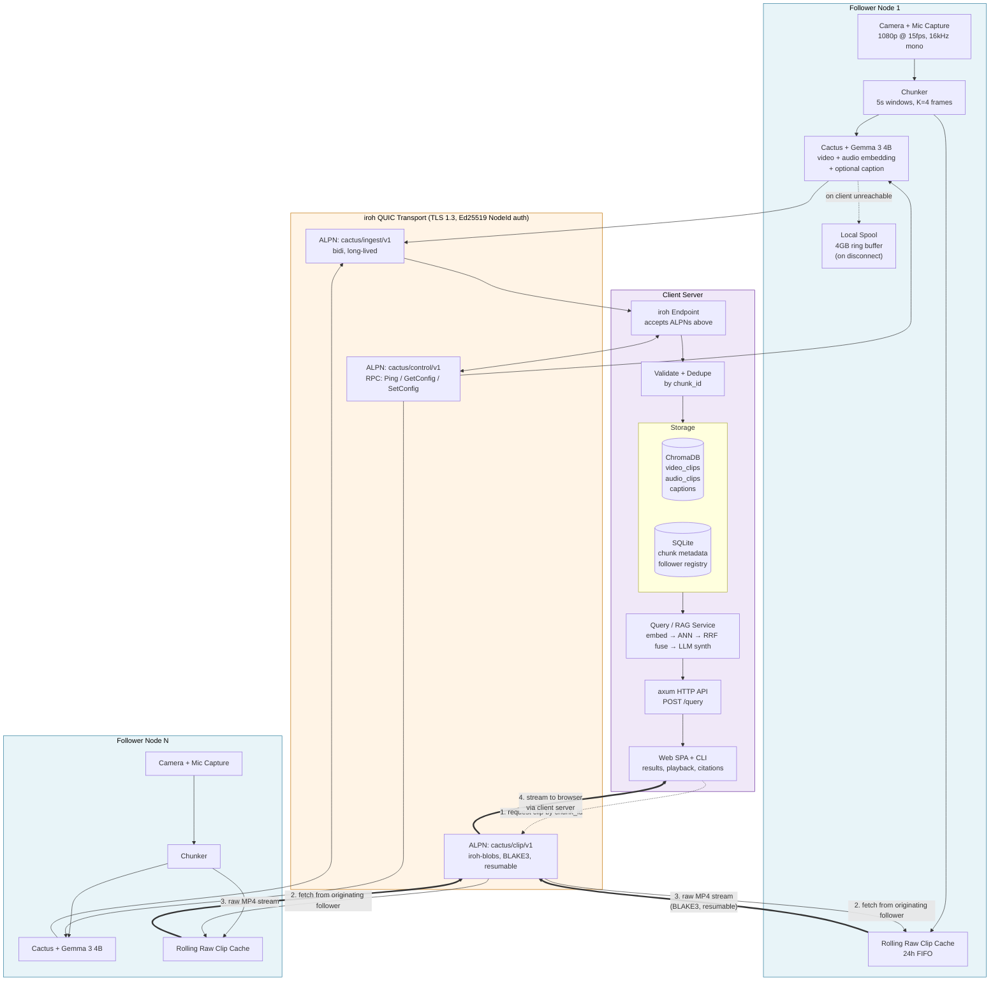
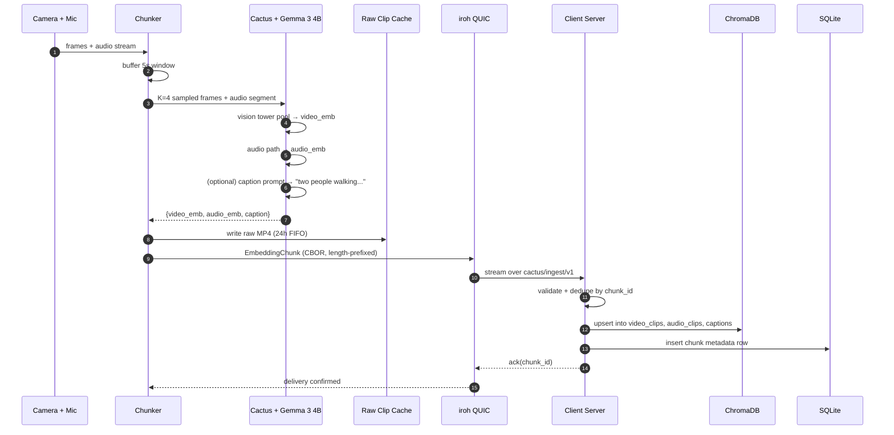
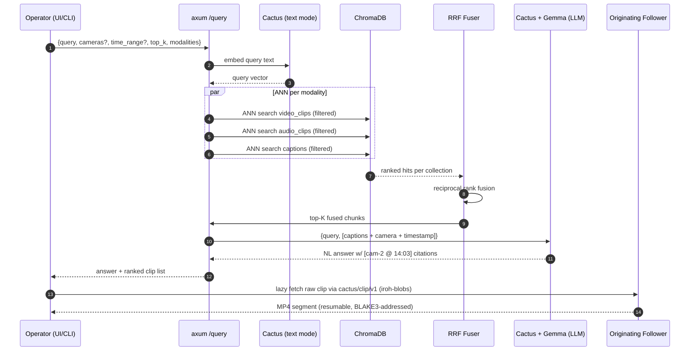
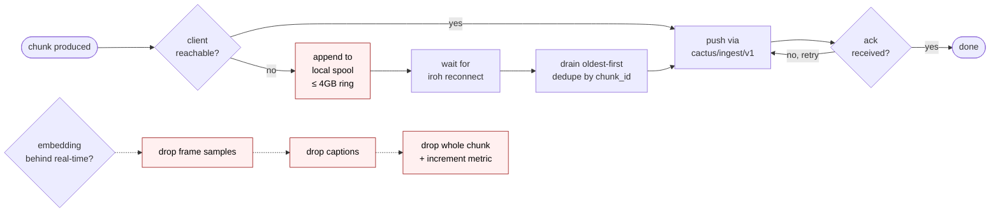
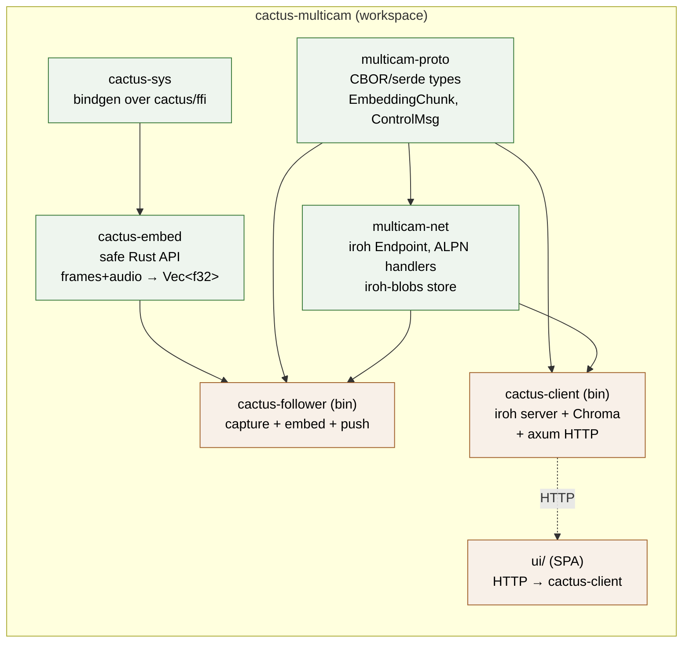
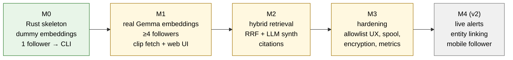

# Multi-Camera Video RAG — Architecture Diagrams

Visual companion to [`PRD-multicam-video-rag.md`](./PRD-multicam-video-rag.md). All diagrams are Mermaid; they render natively on GitHub and in most Markdown previewers.

---

## 1. System Architecture

End-to-end view: N follower nodes embed locally, push only vectors + captions to the client over iroh QUIC, and raw clips stay on the edge until explicitly requested.

---

## 2. Ingest Pipeline (per chunk)

What one follower does with every 5-second window.

---

## 3. Query / RAG Flow

What happens when the operator types a natural-language question.

---

## 4. Failure & Backpressure

How the follower keeps producing when the network or the CPU gets in the way.

---

## 5. Rust Workspace Layout

How the code is organized across crates.

---

## 6. Milestone Progression

